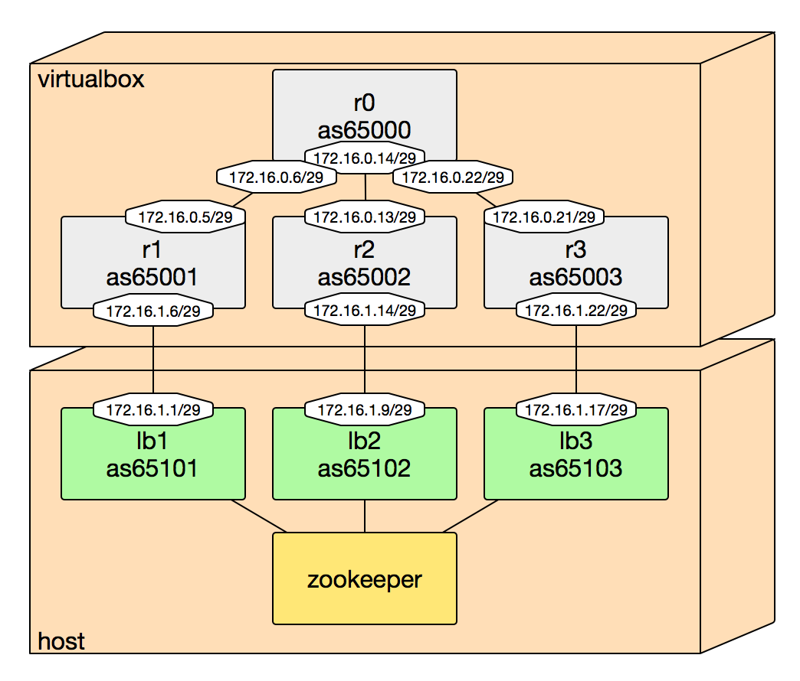

# Intro

This program is to be used as a process for exabgp. It will announce some VIP depending on the state of the VIP in ZooKeeper.

More precisely, it will inconditionnaly announce the VIP it is authoritative for, and will also announce the non-authoritative VIPs if they aren't announced by another instance.

The idea is to a make a service highly available in a network topology using eBGP to route the traffic to the correct path. In this example, we'll use a service named 'apex', and defined in the DNS with 3 VIPs.

This service is provided by a pool of web-servers, and 3 load-balancers. These load-balancers are connected to BGP capable ToR switches. In a nominal situation, each LB announces only 1 VIP, the authoritative one, and writes this to a ZK cluster as an ephemeral node. 

If a LB goes down, the ephemeral node for its authoritative VIP will disappear, and the other LBs will catch it. They'll announce these VIP in turn. As soon as the faulty LB comes back in ZK, the other LB will stop to announce its auth VIP.

A special node, named *maintenance*, is also watched, and if present, the route will be withdrawn. A local check (with a local command) will trigger the same withdrawal too (as exabgp-healthcheck does)

# Installation

This tool uses virtualenv and python 2.7. Please do:

    $ mkvirtualenv exazk
    $ workon exazk
    $ pip install -r requirements.txt

# Run

## testing

Running exazk outside of exabgp (for testing purpose):

    ./exazk.py -f conf/apex-node1.yml

is equivalent to:

    ./exazk.py -sF daemon -c /usr/local/bin/check_local_nginx.sh -n apex -A 10.20.255.1 -N 10.20.255.2 -N 10.20.255.3 -zH localhost -zPS /exabgp/service/apex -zPM /exabgp/maintenance/apex/node1

## inside ExaBGP

Running exazk inside exabgp:

    process exazk-apex {
        run /Users/remi/github/exazk/exazk.py -sF daemon -c /usr/local/bin/check_local_nginx.sh -n apex -A 10.20.255.1 -N 10.20.255.2 -N 10.20.255.3 -zH localhost -zPS /exabgp/service/apex -zPM /exabgp/maintenance/apex/node1;
    }

# Tests 

We provide a Vagrantfile to launch 4 VMs. These VMs run *bird* and are provisionned to be interconnected in a leaf-spine model, using 1 spine (*r0*) and 3 leafs (*r1*, *r2* & *r3*)

One can then launch 3 instances of exabgp + exazk, each one connected to a particular quagga instance, and see how exazk is working. We provide example conf files to do that, in the *conf* directory.

You'll also need a ZK instance too, obviously.

    $ cd tests && vagrant up
    $ vagrant ssh r0 # <= connect to the 1st bird instance
    vagrant@router0:~$ birdc
    BIRD 1.4.5 ready.
    bird> show protocols
    name     proto    table    state  since       info
    kernel1  Kernel   master   up     13:09:43
    device1  Device   master   up     13:09:43
    static1  Static   master   up     13:09:43
    router1  BGP      master   up     13:30:02    Established
    router2  BGP      master   up     13:33:48    Established
    router3  BGP      master   up     13:33:59    Established
    bird> show route
    10.20.255.1/32     via 172.16.0.5 on eth1 [router1 13:43:11] * (100) [AS65101i]
    10.20.255.3/32     via 172.16.0.21 on eth3 [router3 13:41:01] * (100) [AS65103i]
    10.20.255.2/32     via 172.16.0.13 on eth2 [router2 13:42:19] * (100) [AS65102i]

Then launch you zkServer:

    $ zkServer start
    ZooKeeper JMX enabled by default
    Using config: /usr/local/etc/zookeeper/zoo.cfg
    Starting zookeeper ... STARTED

Finally, lauch some exabgp instances:

    $ exabgp conf/exabgp-node1.conf
    Fri, 10 Jun 2016 16:18:17 | INFO     | 32071  | reactor       | Performing reload of exabgp 3.4.13
    [...]
    Fri, 10 Jun 2016 16:18:25 | INFO     | 32123  | reactor       | New peer setup: neighbor 172.16.1.6 local-ip 172.16.1.1 local-as 65101 peer-as 65001 router-id 172.16.1.1 family-allowed in-open
    Fri, 10 Jun 2016 16:18:25 | WARNING  | 32123  | configuration | Loaded new configuration successfully
    Fri, 10 Jun 2016 16:18:25 | INFO     | 32123  | processes     | Forked process exazk-apex
    30: root: ExaZK starting...
    20: kazoo.client: Connecting to localhost:2181
    20: kazoo.client: Zookeeper connection established, state: CONNECTED
    20: root: re-creating my ephemeral node
    20: root: refreshing children & routes
    20: root: advertising routes
    Fri, 10 Jun 2016 16:18:26 | INFO     | 32123  | processes     | Command from process exazk-apex : announce route 10.20.255.1/32 next-hop self med 100
    Fri, 10 Jun 2016 16:18:26 | INFO     | 32123  | processes     | Command from process exazk-apex : announce route 10.20.255.2/32 next-hop self med 200
    Fri, 10 Jun 2016 16:18:26 | INFO     | 32123  | processes     | Command from process exazk-apex : announce route 10.20.255.3/32 next-hop self med 200

A picture to illustrate better:

